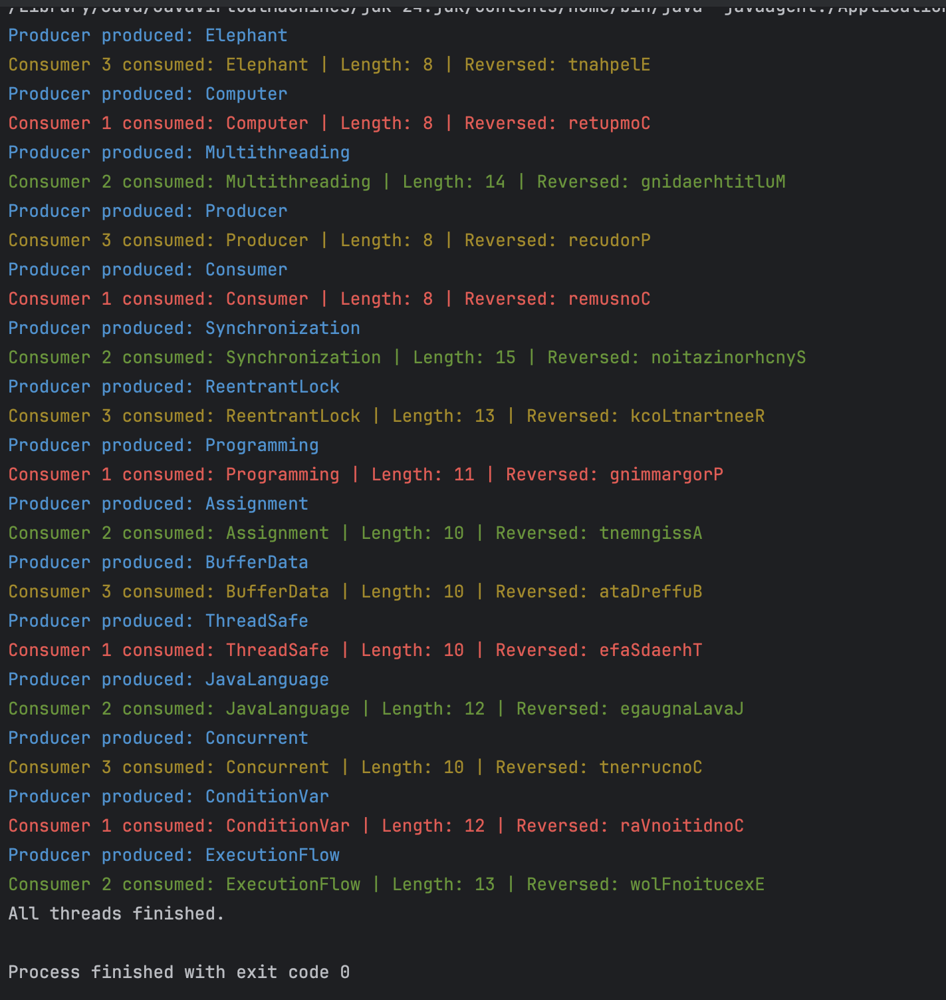

# Producer-Consumer System (Java)

This project demonstrates a multithreaded producer-consumer system implemented in Java using thread-safe synchronization.

## Overview
A producer thread generates data and places it into a shared buffer, while multiple consumer threads process the data concurrently.

## Features
- 1 Producer thread
- 3 Consumer threads
- Thread-safe shared buffer
- Synchronization using ReentrantLock and Condition
- Concurrent data processing
- String manipulation (length calculation + reversal)
- Color-coded thread output for clarity

## Technologies Used
- Java
- Multithreading
- ReentrantLock
- Condition variables

## How It Works
- The producer inserts 15 strings into a shared buffer
- Consumers retrieve strings from the buffer
- Each consumer:
  - Calculates string length
  - Reverses the string
- Synchronization ensures safe access to shared data

## Output Example
Below is a sample run of the program showing producer and consumer interaction:

## Why This Project Matters
This project demonstrates core backend development concepts such as:
- Thread synchronization
- Concurrent programming
- Safe shared resource handling
